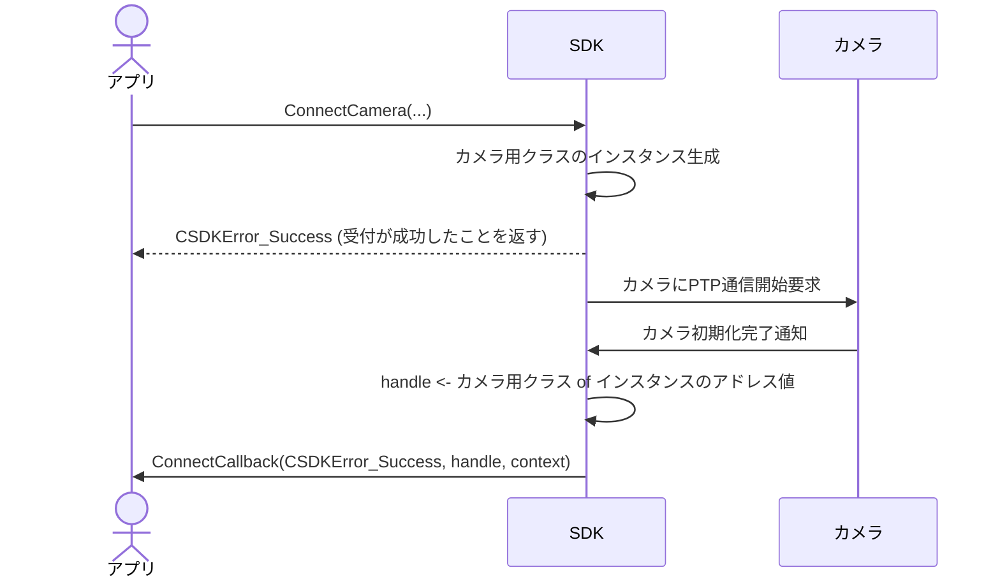
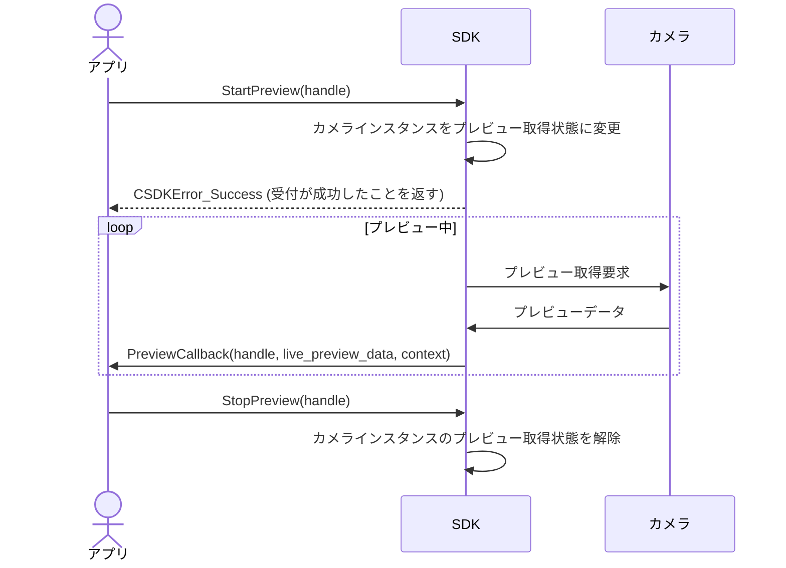
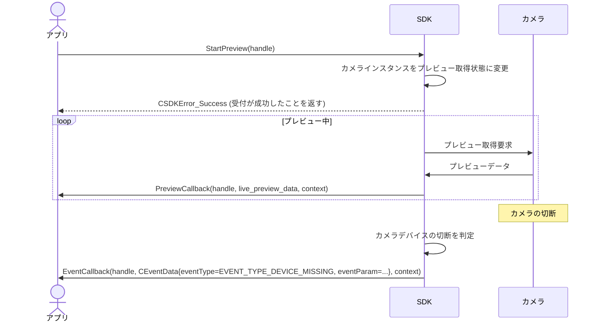
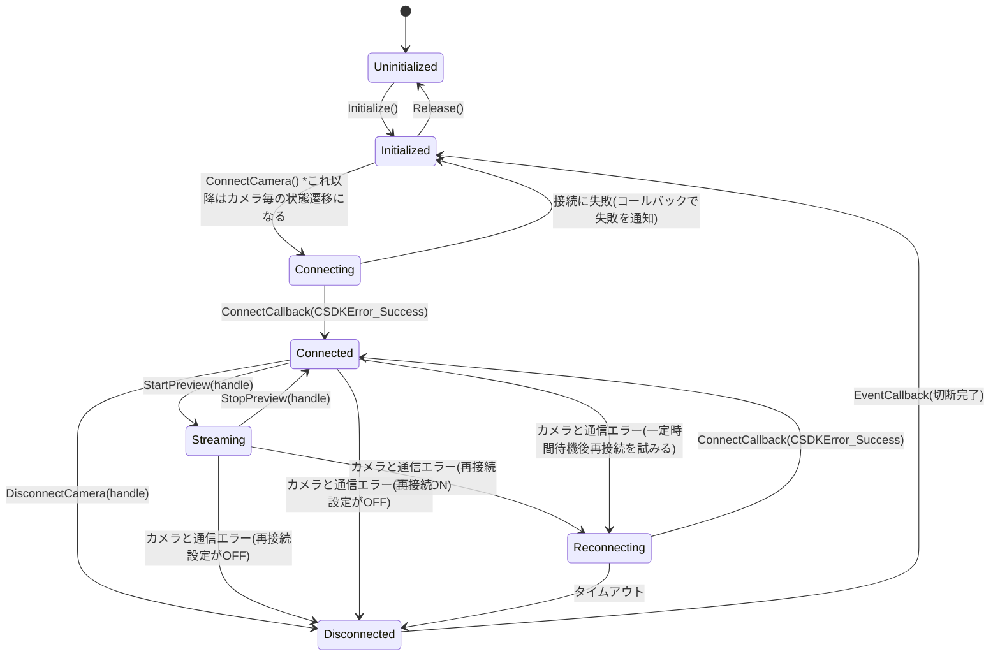

# C社カメラ用SDK 基本設計書 - Session 3

このファイルに、SDKの「シーケンス図」と「状態遷移図」を書き込んでみましょう。

---

## 1. シーケンス図

### 1.1 カメラ接続シーケンス（正常系・非同期）

### 1.2 ライブプレビュー開始〜画像取得〜終了シーケンス（正常系）

### 1.3 プレビュー中の突発的な切断シーケンス（異常系）

---

## 2. 状態遷移図

### 2.1 SDK/カメラ接続状態の定義
- **Uninitialized**: SDK初期化前
- **Initialized**: SDK初期化後、カメラ未接続
- **Connecting**: カメラ接続中
- **Connected**: カメラ接続完了
- **Reconnecting**: カメラ接続切断後の再接続中
- **Disconnected**: カメラの切断完了
- **Streaming**: カメラのプレビュー取得状態

### 2.2 状態遷移図

---

## 3. 【設計判断】なぜこの動的挙動・状態遷移にしたのか？

- 【同期/非同期の設計判断理由について】
  - ConnectCameraを非同期にしたのは処理に時間がかかり、アプリ側がフリーズしてしまう為。コールバックで通知するようにした。
  - StartPreviewを非同期にしたのは画像の取得が連続的なもので一回の呼び出しではない為。
  - StopPreviewから復帰した後はPreviewCallbackが呼ばれないようにSDK側は制御する。つまり、StopPreviewは止めるまで処理が続く同期的な処理となる。
  - DisconnectCameraは非同期でイベントを返すが、その理由は接続と同じで処理に時間がかかるかもしれない為。
- 【状態遷移とエラーリカバリの設計判断理由について】
  - カメラの操作とは別でInit/Releaseを設けたのは、カメラの操作に関連してスレッドプールの立ち上げといった関連リソースの確保/解放を行いたい為。将来的な関連リソースの増加にも対応が可能になる点もある。
  - Connecting/Connectedで別の状態にしているのは、Connectedだけだと接続ができてない状態を適切に管理できない為。
  - カメラは何かしらの接続(USB,Ether,Wifi)で接続されており、必ずしも接続が安定している訳ではない為、再接続が必要なのでReconnectingを用意した。
  - Connectedから直接Disconnectedにつながるのは、再接続シーケンスを設けずに通信エラーから再度接続するかどうかをアプリに委ねられるようにする為。
