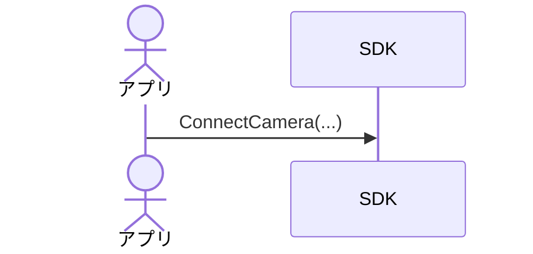

# C社カメラ用SDK 基本設計書 - Session 3

このファイルに、SDKの「シーケンス図」と「状態遷移図」を書き込んでみましょう。
（※ `【 】`で囲まれた部分はガイドです。適宜書き換えたり削除したりしてください。図の作成にはMermaid記法を推奨しますが、難しければ箇条書きテキストでも構いません）

---

## 1. シーケンス図

【主要なユースケースのシーケンスを定義してください。最低限、「カメラ接続（非同期）」と「プレビュー開始〜フレーム取得〜プレビュー終了」の流れは描き出しましょう。】

### 1.1 カメラ接続シーケンス（正常系・非同期）
【`ConnectCamera` の呼び出しから、コールバックが通知され、ハンドルが有効になるまでの流れを記述してください。】



### 1.2 ライブプレビュー開始〜画像取得〜終了シーケンス（正常系）
【`StartPreview` の呼び出し、コールバックでの複数回の画像受信、そして `StopPreview` による終了までの流れを記述してください。】

```mermaid
%% 【ここにプレビューのシーケンス図を記述してください】
```

### 1.3 プレビュー中の突発的な切断シーケンス（異常系）
【プレビュー中にカメラが物理的に抜けた（UC-07）場合、SDKがそれをどう検知し、アプリのコールバックやAPIを通じてどのようにエラー処理されるかを記述してください。】

```mermaid
%% 【ここに異常系のシーケンス図を記述してください】
```

---

## 2. 状態遷移図

【SDKまたは接続された個別カメラの「状態遷移」を定義してください。】

### 2.1 SDK/カメラ接続状態の定義
【どのような状態が存在するか、一覧を記述します。】
- **状態A**: 説明
- **状態B**: 説明

### 2.2 状態遷移図
【Mermaid等の記述を用いて、どのイベント（API呼び出しやハードウェア割り込み）によってどの状態へ遷移するかを定義してください。】

```mermaid
%% 【ここに状態遷移図を記述してください】
stateDiagram-v2
    %% [*] --> 状態A
```

---

## 3. 【設計判断】なぜこの動的挙動・状態遷移にしたのか？

【「なぜ接続を非同期処理にしたのか」「なぜこの状態定義にしたのか」「異常切断時にどのようなリカバリ遷移にするか」の理由を記述してください。】

* **記述例**:
  * カメラの接続に最大数秒かかる可能性があるため、GUIアプリがフリーズするのを防ぐために `ConnectCamera` を非同期とし、完了はコールバックで通知する設計にした。
  * プレビュー中にエラーが発生した場合は、一度 `Disconnected`（初期状態）まで強制的に状態を引き戻し、アプリ側にリソースの再解放と再接続を要求するシンプルな遷移を採用した。これにより、SDK内部の複雑な再試行ロジックを排除し、堅牢性を高めた。

- 【同期/非同期の設計判断理由について】
- 【状態遷移とエラーリカバリの設計判断理由について】
