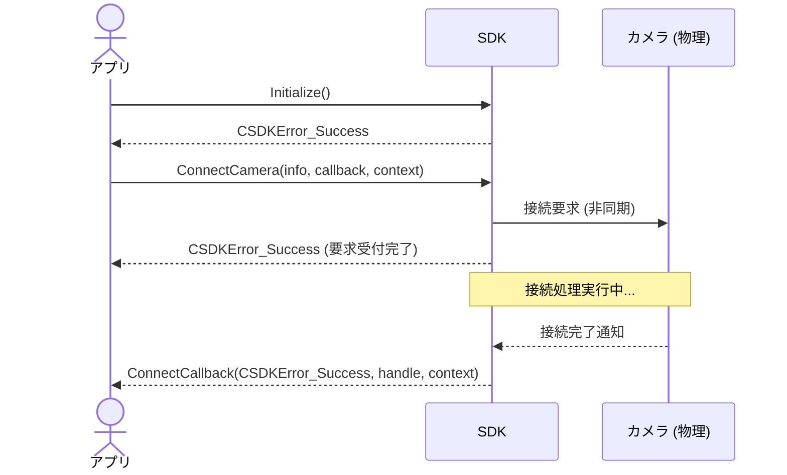

# Session 3 ガイド：動的挙動の設計

このセッションでは、Session 2 で定義した静的なインターフェース（API・データ構造）が、時間経過やイベントに伴ってどのように呼び出され、状態を遷移させるかという **「動的挙動」** を設計します。

主な対象項目は **「シーケンス図」** と **「状態遷移図」** です。

---

## 1. シーケンス図

### Q. なぜ必要なのか？
API単体では「何を渡して何を返すか」しか分かりません。しかし実際のアプリケーションは、「APIを呼ぶ順序」や「非同期コールバックがどのスレッドから返ってくるか」といった**時間軸の整合性**が正しく設計されていないと、フリーズや競合状態（レースコンディション）を起こしてしまいます。

### 💡 設計判断のポイント：どこを同期にし、どこを非同期にするか？
SDKの処理には、瞬時に終わる処理（同期的）と、通信やデバイスの応答待ちで時間がかかる処理（非同期的）があります。

* **同期処理の例**: `GetCameraSetting` などのローカル値取得。
* **非同期処理 of 例**: `ConnectCamera`（接続確立）、`StartPreview` からの継続的な画像配信（ストリーミング）。
  * 非同期処理の場合、アプリ側は「処理の開始指示」を出した後、裏で何が起き、どのタイミングで「完了」や「フレーム受信」を通知されるのか、そのライフサイクルをシーケンス図で明らかにします。

### 💡 Mermaid表記を活用する
設計書内にシーケンス図を描く際、テキストベースで図を描ける `mermaid` 記法を活用すると便利です。
例えば、以下のように記述できます。

---

## 2. 状態遷移図

### Q. なぜ必要なのか？
カメラやSDKは、「現在の状態」によって受け付けられる操作が異なります。例えば、「接続前」に `StartPreview` (プレビュー開始) を呼び出すとエラーになりますし、「プレビュー中」に再度 `StartPreview` を呼んだ場合の挙動はどうあるべきでしょうか。
これらを整理し、**「不正なAPI呼び出しをどう防ぐ（あるいはどうエラーにする）か」**を決めるのが状態遷移図です。

### 💡 設計判断のポイント：状態（State）をどう定義するか？
C社カメラSDKにおいて、管理すべき主要な状態を洗い出します。
* **未初期化 (Uninitialized)**: `Initialize` 前
* **初期化済 (Initialized)**: SDKは使えるがカメラ未接続
* **接続中 (Connecting)**: 接続試行中
* **接続済 (Connected)**: カメラ操作可能、プレビューは停止中
* **プレビュー中 (Streaming)**: 画像フレームをストリーミング送信中
* **エラー状態 / 切断 (Error/Disconnected)**: 例外が発生し、回復が必要な状態

これらを Mermaid の `stateDiagram-v2` を使って図示してみましょう。

---

## 3. 次のステップ：ドラフトの作成

- [Session 3 ドラフト (session3_draft.md)](file:///e:/workspace/job_change/portfolio_base_design/docs/my_design/session3_draft.md) を開き、シーケンス図と状態遷移図を Mermaid もしくはテキストで記述してみましょう。
- 完璧な図面でなくても構いません。APIの流れや状態変化の辻褄が合うように書いてみましょう！
