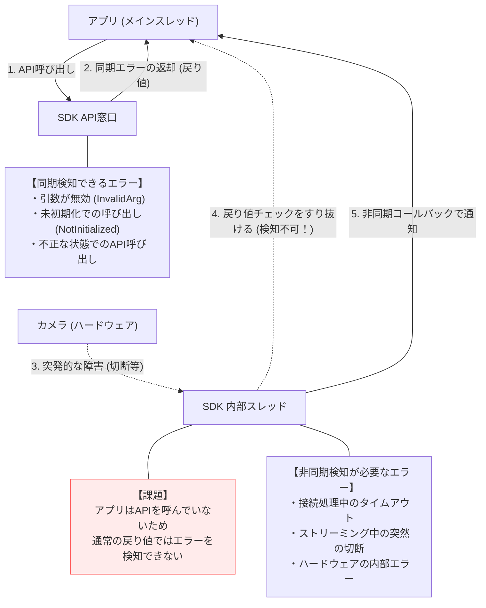
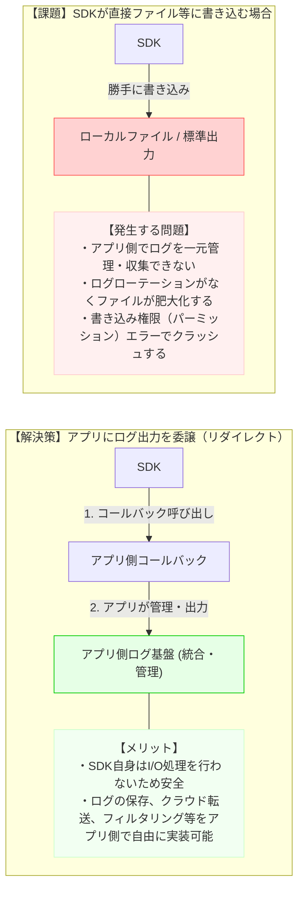
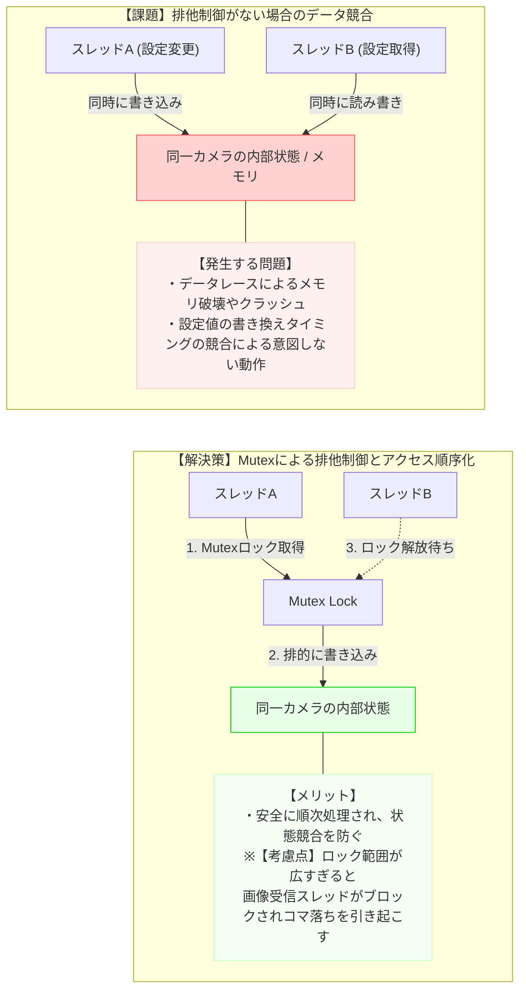

# Session 4 ガイド：堅牢性の設計（エラー・ログ・スレッド設計）

このセッションでは、SDKが予期せぬ状況やマルチスレッド環境下でも安全かつ堅牢に動作するための **「堅牢性の設計」** を行います。
具体的には **「エラー設計」** **「ログ設計」** **「スレッド・排他制御方針」** を定義します。

---

## 1. エラー設計

### Q. なぜ必要なのか？
SDKは様々な環境（ネットワーク切断、メモリ不足、不正なAPI呼び出し等）で利用されます。エラーが発生した際に、アプリ側が「何が原因で」「どう対処すればよいか」を的確に判断できるようなエラー体系が必要です。

### ⚠️ エラー設計の課題：同期エラーと非同期エラーのハンドリングの乖離
SDKの設計で最も陥りがちな失敗は、**「すべてのエラーをAPIの戻り値（エラーコード）で返そうとすること」**です。バックグラウンドで発生するデバイスの障害や切断は、アプリがAPIを呼び出していないタイミングで発生するため、通常の戻り値チェックでは検知できません。

### 💡 設計判断のポイント：エラーコードと例外、通知方法
* **エラーコードの体系化**:
  - `CSDKError` のような単なるEnumでも、エラーカテゴリ（共通、通信系、カメラ依存、内部エラー等）ごとに値の範囲を分けることで、将来の拡張時にも整理されたコードを維持できます。
* **例外（Exception）か、エラーコードか**:
  - CスタイルAPIの場合はエラーコード（戻り値）を返すのが基本ですが、C++やC#、Javaなどのラッパーを作成する場合、どのタイミングで例外を投げるべきかの基準を定義します。
* **非同期エラーの通知**:
  - コールバック処理（接続中、プレビュー中）の最中に発生したエラーは、APIの戻り値では返せません。これらは `EventCallback` などを通じてどのようにアプリに通知されるかを明確にします。

---

## 2. ログ設計

### Q. なぜ必要なのか？
SDKはアプリの中に組み込まれるバイナリであるため、不具合が発生した際に「SDK内部で何が起きていたか」を外部から確認する手段が必要です。適切なログ設計は、本番環境での問題発生時のデバッグ時間を劇的に短縮します。

### ⚠️ ログ設計の課題：SDKのログとアプリのログの分断
SDKが自身の判断で特定のログファイル（例: `sdk.log`）や標準出力にログを書き出してしまうと、アプリ全体のログ運用（ローテーション管理、暗号化、クラウドへの送信など）と競合し、ログの紛失や書き込みエラーによるクラッシュを引き起こします。

### 💡 設計判断のポイント：ログレベル、出力方式、パフォーマンス
* **ログレベルの定義**:
  - `FATAL`, `ERROR`, `WARNING`, `INFO`, `DEBUG`, `TRACE` などの役割と、どのような内容をどのレベルで出力すべきかを決めます。
* **ログ出力先の設定とハンドリング**:
  - **推奨方式**: アプリ側からログ出力用のコールバック関数を登録させ、SDK内のログはすべてそのコールバック経由でアプリ側に渡す設計（Log Callback方式）にすることで、柔軟性が大幅に向上します。
* **パフォーマンスへの影響**:
  - 高速ストリーミング中（プレビュー中）に、フレーム毎に詳細なデバッグログを出力するとパフォーマンスが大幅に低下します。高頻度なイベントでのログ出力を制限する方針が必要です。

---

## 3. スレッド・排他制御方針

### Q. なぜ必要なのか？
現代のGUIアプリケーションは、UIスレッド、通信スレッド、ワーカースレッドなどマルチスレッドで動作します。SDKのAPIが複数のスレッドから同時に呼び出されたり、SDK内部の非同期スレッドがアプリ側のスレッドと干渉したりする際に、デッドロックやメモリの競合（データレース）を防ぐ必要があります。

### ⚠️ スレッド設計の課題：複数スレッドからの同時操作による競合
アプリがマルチスレッド環境（例: UIスレッドとバックグラウンドタスク）で動作する場合、同一のカメラハンドルに対して同時に設定変更APIが呼ばれると、SDK内部のメモリ破壊や状態の不整合が発生し、最悪の場合はアプリごとクラッシュします。

### 💡 設計判断のポイント：スレッドセーフ性の保証と排他制御
* **APIのスレッドセーフティ**:
  - 「どのAPIが複数スレッドから同時に呼べるのか（再入可能か）」「同時に呼んではいけないAPIはどれか（例: `Release()` と `GetCameraSetting()` の同時呼び出しなど）」を明確にします。
* **内部スレッドモデル**:
  - SDK内部でどのようなスレッド（受信スレッド、接続試行スレッド、イベント配信スレッド等）を生成して管理するのかを定義します。
* **排他制御（Mutex/Lock）の粒度**:
  - 状態遷移や内部データの書き換え時にどのロックを使用するか、またデッドロックを防ぐために「ロックを取得する順番のルール」などを定めます。

---

## 次のステップ：ドラフトの作成

- [Session 4 ドラフト (session4_draft.md)](file:///e:/workspace/job_change/portfolio_base_design/docs/my_design/session4_draft.md) を作成し、これらの堅牢性に関する設計を記述してみましょう。
- 完璧な実装コードを書く必要はありません。どのような設計思想でエラー、ログ、マルチスレッドを制御するかの「方針」と言い訳（設計判断）を書いていきましょう！
