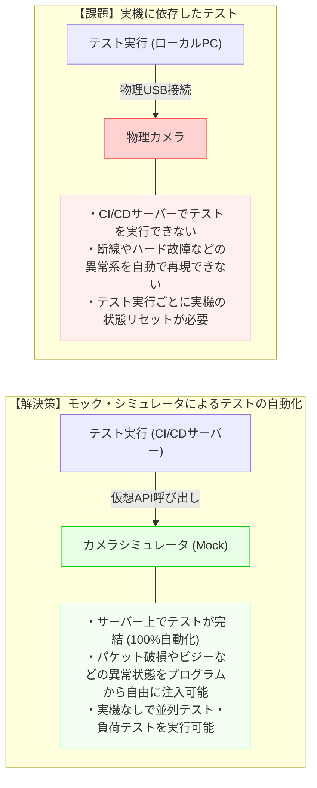

# Session 5 ガイド：品質とテスト（非機能要件・性能要件、テスト観点）

このセッションは、本プロジェクトの最終章です。SDKが単に「動く」だけでなく、実際のプロダクトとして「安定して高パフォーマンスに動作し」「継続的な品質保証が可能である」ことを定義する **「品質とテストの設計」** を行います。

具体的には **「非機能要件・性能要件」** **「テスト設計方針（テスト観点）」** **「シミュレータ（Mock）活用方針」** を記述します。

---

## 1. 非機能要件・性能要件

### Q. なぜ必要なのか？
SDKは他のアプリケーション（工場の外観検査アプリ、ライブ配信配信ソフトなど）のパーツとして組み込まれます。そのため、SDK自体が大量のCPUやメモリを消費したり、処理遅延（レイテンシ）を発生させたりすると、親アプリ全体の動作を損ねてしまいます。あらかじめ「ここまでならリソースを使ってよい」「この処理速度を保証する」という境界（非機能要件）を定めておくことが不可欠です。

### ⚠️ カメラSDKにおける性能の壁：リアルタイムデータの転送と遅延
4K解像度（3840x2160）で30fpsの動画ストリームを扱う場合、1秒間に処理すべき生データ量は膨大です（RGBやYUVの未圧縮フォーマットであれば、1秒あたり数百MBに達します）。このデータを遅延なく、かつCPU負荷を抑えて処理するには、以下のような性能設計が必要です。

```mermaid
graph TD
    Cam["カメラ (物理デバイス)"]
    USB["物理転送 (USB/Ether)"]
    SDK_Buf["SDK 内部バッファ (プール)"]
    App_Buf["アプリ側バッファ (ゼロコピー)"]
    App_Proc["アプリ処理 (描画・AI解析)"]

    Cam -->|1. 画像キャプチャ| USB
    USB -->|2. パケット受信| SDK_Buf
    SDK_Buf -->|3. コピー処理 (遅延 & CPU負荷の原因)| App_Buf
    App_Buf -->|4. コールバック通知| App_Proc

    note_issue["【遅延とCPU負荷のボトルネック】<br/>・高頻度なメモリ割り当て (malloc/new) <br/>・スレッド間のデータコピーオーバーヘッド<br/>・スレッドのコンテキストスイッチ切り替え"]
    SDK_Buf -.-> note_issue
    style note_issue fill:#ffebeb,stroke:#ff5555
```

### 💡 設計判断のポイント：非機能目標値の設定
* **遅延目標（レイテンシ）**:
  - パケットを受信してからユーザーにコールバックするまでのSDK内部のオーバーヘッドを何ミリ秒（ms）以下に抑えるか。
* **リソース制限**:
  - メモリプールが使用する最大バッファ数や、最大メモリ使用量を定義します。
* **スケーラビリティ**:
  - 同一PCで何台までカメラを同時制御することを想定しているか（USB帯域やポート制限、スレッド生成の限界値）。

---

## 2. テスト設計方針（テスト観点）

### Q. なぜ必要なのか？
SDKはAPI（コード）の形で提供されるため、UIのテストツールが使えません。また、C言語インターフェースは不正なポインタ渡しなどで容易にクラッシュするため、徹底した境界値テストとメモリリークの検出が求められます。

### ⚠️ 開発の課題：物理デバイス（カメラ実機）依存によるテストの限界
物理的なカメラを使ってテストを行うと、以下のような問題が発生します。
1. **CI/CD（自動テスト）が回せない**: クラウド上のビルドサーバーに物理カメラを繋ぐことができないため、コミットごとの自動テストが困難。
2. **異常系の再現が難しい**: 「通信パケットが壊れた」「カメラの電源が瞬断した」「ビジーエラーが返ってきた」などの境界条件・異常系を実機で意図的に再現するのが難しい。



### 💡 設計判断のポイント：モック・シミュレータの活用
* **シミュレータ（仮想カメラ）の導入**:
  - PTP通信層の下部を抽象化し、実機がなくても「コマンドに対してダミーの画像やエラーコードを返す」モックレイヤーを実装することで、テストのカバレッジを圧倒的に高めることができます。
* **メモリリークとデッドロックの検出**:
  - 複数スレッドが競合する状態（プレビュー開始・停止の無限ループ等）の耐久テスト、ツール（Valgrind, AddressSanitizer）による検証方針を定めます。

---

## 次のステップ：設計書の仕上げ

- 新規作成した [Session 5 ドラフト (session5_draft.md)](docs/my_design/session5_draft.md) に、これらの品質目標やテスト観点を記述してみましょう。
- このファイルが完成すれば、基本設計書はすべて完成となります！
